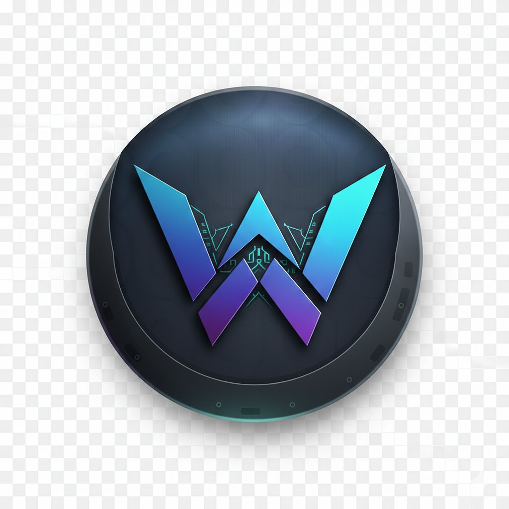
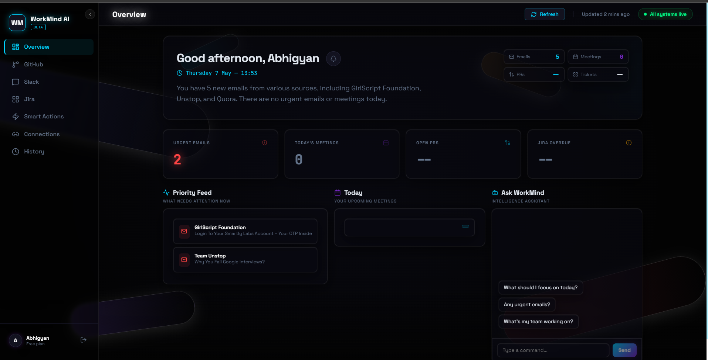

<div align="center">
  
  <h1>WorkMind AI</h1>
  <p>An MCP-based AI assistant that connects Gmail, GitHub, Slack, Jira, and Google Calendar into one dashboard — and actually takes action for you.</p>

  [](https://work-mind-ai.vercel.app)
  [](https://workmind-ai-production.up.railway.app)
  [](LICENSE)
</div>

---

Most developers have the same problem — Gmail in one tab, GitHub in another, Slack pinging, Jira open somewhere, Calendar buried. **WorkMind AI pulls all of that into one place** and uses AI to do the summarizing, writing, and scheduling for you.

You log in once with Google. The rest is automatic.

<br/>



---

## What it does

**Daily Briefing** — When you open the app, it fetches everything across all your tools and generates a morning summary. What emails need attention, what meetings are coming up, which PRs are open, what Jira tickets are overdue. No manual effort.

**Send emails by command** — Instead of drafting and copy-pasting, you just describe what to send:
```
"Reply to Ravi's email and tell him the build will be ready by Thursday"
```
WorkMind writes it and sends it directly from your Gmail. This was the biggest pain point we solved — earlier it only drafted the reply, you still had to send it yourself.

**Schedule meetings** — Same idea for Calendar:
```
"Schedule a 30-min call with the team tomorrow at 4 PM"
```
The event gets created in Google Calendar without you touching it.

**AI Standup Generator** — Go to the GitHub tab, click one button, get your standup note written from your actual commits and PRs. Takes about 2 seconds.

**Smart Actions** — A dedicated section for heavier tasks: draft a reply to any email, prep notes before a meeting, compose and send emails, schedule calendar events.

**AI Chat** — Ask anything about your workday and it answers from your real data, not generic context.

**Alerts** — Urgent emails, overdue tickets, and critical Slack messages get flagged and surfaced so nothing slips.

**History** — Every briefing, draft, and action is saved so you can look back at anything.

---

## How it works

The backend is built around the **Model Context Protocol (MCP)** — our FastAPI server acts as an MCP server that pulls data from all integrations simultaneously and passes the full context to Groq (LLaMA 3.1 8b). The AI doesn't just know what you typed, it knows your actual work state.

```
React Frontend
      │
      ▼
FastAPI (MCP Server)
      │
  ┌───┴─────────────────────────┐
Gmail  Calendar  GitHub  Slack  Jira
  └────────────────┬────────────┘
                   ▼
            Groq LLaMA 3.1
                   │
             Smart Response
                   │
           Supabase (persisted)
                   │
             Back to you
```

---

## Stack

| | |
|---|---|
| Frontend | React + Vite + Tailwind CSS + Framer Motion + Three.js |
| Backend | Python + FastAPI |
| AI | Groq API — LLaMA 3.1 8b Instant |
| Database | Supabase (PostgreSQL) |
| Auth | Google OAuth 2.0 |
| Deploy | Vercel (frontend) · Railway (backend) |

---

## Running locally

**Prerequisites:** Node 18+, Python 3.10+, a Supabase project, a Google Cloud project with Gmail + Calendar APIs enabled, and a Groq API key.

```bash
git clone https://github.com/iitdsiddhant18-blip/WorkMind-AI.git
cd WorkMind-AI
```

**Backend**
```bash
cd backend
pip install -r requirements.txt
cp .env.example .env   # fill in your keys
uvicorn main:app --reload
```

**Frontend**
```bash
cd frontend
npm install
cp .env.example .env.local   # add backend URL + Google client ID
npm run dev
```

Open `http://localhost:5173` and sign in with Google.

---

## Environment variables

**`backend/.env`**
```env
GROQ_API_KEY=
SUPABASE_URL=
SUPABASE_KEY=
GOOGLE_CLIENT_ID=
GOOGLE_CLIENT_SECRET=
GITHUB_CLIENT_ID=
GITHUB_CLIENT_SECRET=
SLACK_CLIENT_ID=
SLACK_CLIENT_SECRET=
JIRA_CLIENT_ID=
JIRA_CLIENT_SECRET=
```

**`frontend/.env.local`**
```env
VITE_API_URL=http://localhost:8000
VITE_GOOGLE_CLIENT_ID=
```

---

## Backend structure

```
backend/
├── main.py                   # all API routes
├── mcp_server.py             # MCP server — feeds context to AI
├── gmail_service.py          # fetch emails + send
├── calendar_service.py       # fetch events + create meetings
├── github_service.py         # PRs, issues, commits
├── slack_service.py          # channel messages
├── jira_service.py           # tickets + sprint tracking
├── chat_service.py           # AI chat
├── smart_actions_service.py  # email drafts, meeting prep
├── alerts_service.py         # urgency detection
├── supabase_service.py       # persistence layer
└── oauth_service.py          # GitHub, Slack, Jira OAuth
```

---

## Roadmap

- [x] AI Daily Briefing
- [x] Gmail — fetch, priority detection, direct send
- [x] Google Calendar — view + schedule meetings via command
- [x] GitHub — PRs, issues, AI standup generator
- [x] Slack feed
- [x] Jira tracking
- [x] AI Chat (context-aware)
- [x] Smart Actions
- [x] Alerts + History
- [ ] Notion integration
- [ ] Linear integration
- [ ] Microsoft Teams
- [ ] Mobile app

---

## Contributing

Fork the repo, create a branch off `main`, make your changes, and open a PR. Issues and feature requests are welcome — check the open issues before starting something new.

---

## License

MIT — see [LICENSE](LICENSE).
